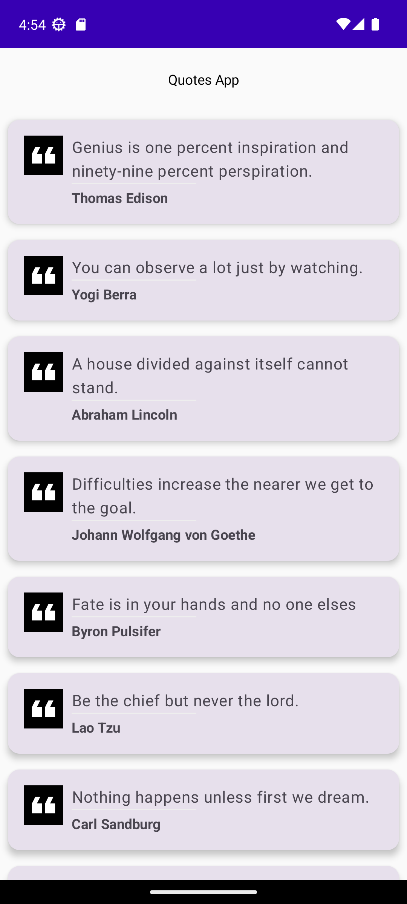
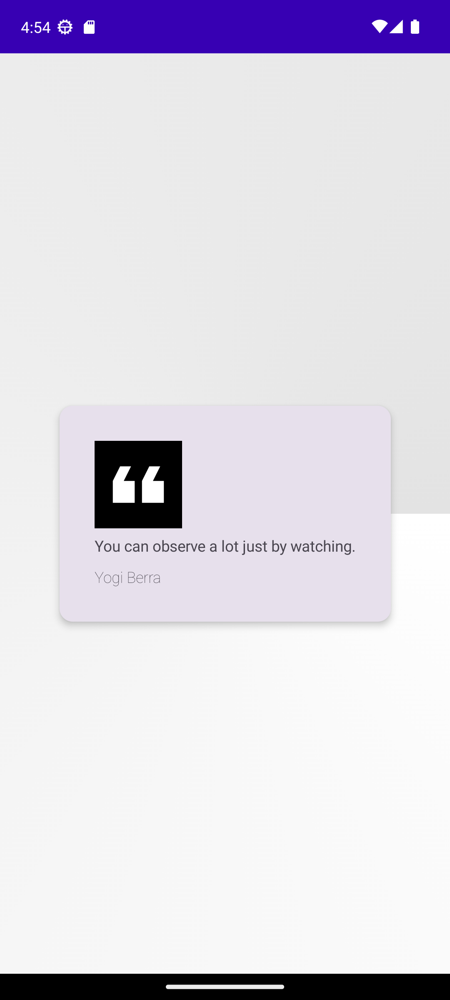

# Quotes

Currently this application is fetching Quotes data from a Local repository file.

Used Jetpack Compose for UI .

With the use of mutablestate we used to store the Navigation page.

//TODO
1. Implement Navigation using Navigation Framework
2. Directly fetch data from REST API and store the data in local and then display the data.

## Screenshots

https://github.com/jshu000/Quotes-App/blob/7803ac95abbb35d390d22a61f5167fb96ec500a0/Quotes_App_demo.webm
Quotes_App_demo.webm

